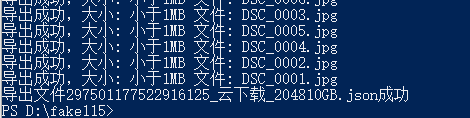

# fake115-go
115网盘助手Go版本，完整保留导出、导入的结构，导出的目录什么样，导入就什么样😲，达到跟雷达功能一致的效果，且没有大小限制。


<del>目前成功导出、导入多个文件夹，大的有70万个文件😄。</del>115现在短时间内导出太多文件会直接将账号踢下线，只能暂时模仿115浏览器本身的下载和上传频率。

<p></p>

已更新新版导出文件方式，感谢`https://github.com/orzogc/fake115uploader`的加密代码😊。

## Download


https://github.com/gawwo/fake115-go/releases


## Installation


#### Clone


```bash
git clone https://github.com/gawwo/fake115-go
cd fake115-go
```


#### Get the dependencies


```bash
go get ./...
```


#### Build

```bash
go build -o fake115 .
```


## Getting Started


#### Prepare


从115浏览器中获取自己登陆后的cookie。


可以在程序目录下创建一个`cookies.txt`的文件存放cookie，也可以在使用时，添加`-c`参数设置cookie。


#### Export


- cid是指115文件夹的id，F12的开发者工具中查看network能找到它。


Usage:

```bash
fake115 -c "cookiexxxxx" <your export cid>

# 示例
fake115 1898007427015248622
```


#### Import


Usage:

```bash
fake115 -c "cookiexxxxx" <your import cid> <import json file path>

# 示例
fake115 353522044329243945 1898007427015248622_纪录片_438GB.json
```

#### 参数

导出/导入过快，可能会被阻止暂时访问，导致任务失败。

-n 同时进行的任务数，默认为1

-i 网络等待间隔，默认为3s

-f 过滤小于此大小的文件，单位KB，默认为0，不过滤

